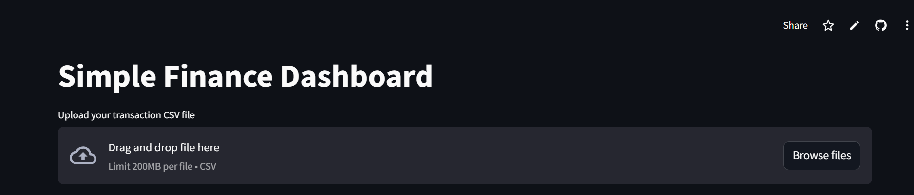
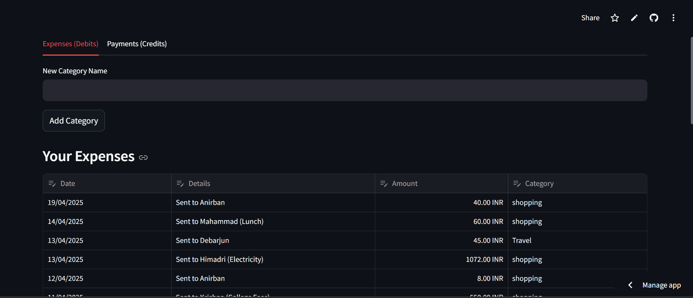
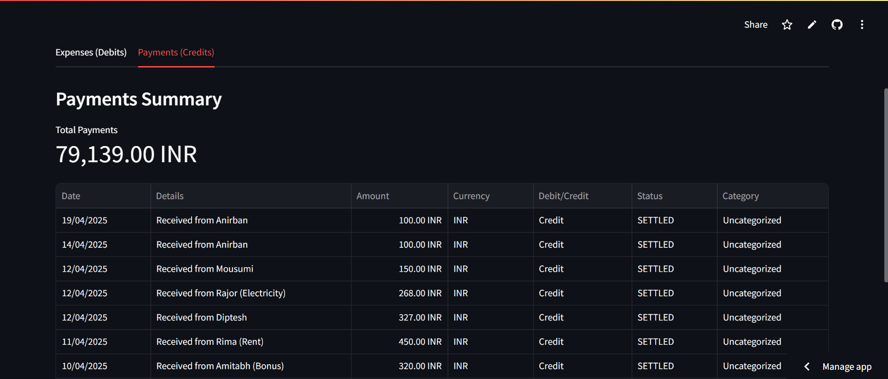
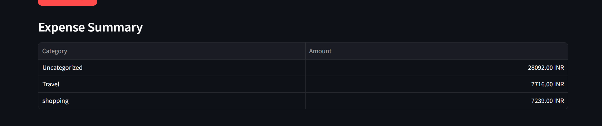
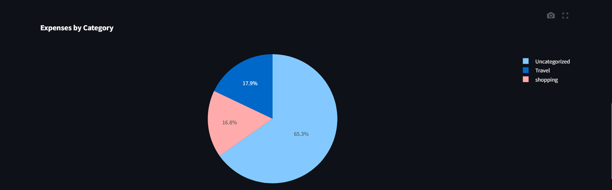

```markdown

🔗 **Live Demo**: [Click here to try the app](https://fintrackproject-77ustmp2brihre5gzgpxsr.streamlit.app/)


# 💰 FinTrack - Personal Finance Tracker

FinTrack is a simple and effective personal finance tracking web application built using **Python** and **Streamlit**. It allows users to upload transaction data via CSV files, automatically categorize expenses, analyze income/expenses, and visualize financial summaries with clean, interactive graphs.

---

## 🚀 Features

- 📂 **CSV Upload** – Upload transaction files (bank statements or custom format)
- 🔍 **Auto-Categorization** – Categorizes transactions based on keywords
- 🧠 **Keyword Mapping** – Users can map keywords to categories for better accuracy
- 📊 **Visualizations** – Pie charts and bar graphs of income vs. expenses
- 📅 **Date-wise Summary** – Monthly summaries of credits and debits
- 🔄 **Reset & Re-analyze** – Easily clear data and reprocess as needed

---

## 🖥️ Tech Stack

- **Python**
- **Streamlit** (Web App Framework)
- **Pandas** (Data Analysis)
- **Matplotlib / Altair** (Visualizations)
- **Regex** (Keyword Matching)

---

## 📸 Screenshots






---

## 📁 Folder Structure

```bash
fintrack_project/
├── app.py                # Main Streamlit app
├── data/                 # (Optional) Sample CSV files
├── requirements.txt      # Required Python packages
└── README.md             # Project documentation
```

---

## 📦 Installation

### Step 1: Clone the repository
```bash
git clone https://github.com/Tom-1508/fintrack_project.git
cd fintrack_project
```

### Step 2: Create and activate a virtual environment (optional but recommended)
```bash
python -m venv venv
# Windows:
venv\Scripts\activate
# macOS/Linux:
source venv/bin/activate
```

### Step 3: Install dependencies
```bash
pip install -r requirements.txt
```

---

## ▶️ Run the App

```bash
streamlit run app.py
```

The app will open in your default browser at `http://localhost:8501`.

---

## 🧪 Sample CSV Format

Your CSV file should include at least the following columns:

- **Date**
- **Description**
- **Amount** (positive for credit, negative for debit)

Example:
```csv
Date,Description,Amount
2024-12-01,Coffee Shop,-150
2024-12-01,Salary,20000
2024-12-02,Amazon Purchase,-999
```

---

## 🧠 Future Improvements

- User authentication
- Persistent keyword mapping
- Export analyzed data to CSV
- Enhanced analytics with filters

---

## 🙌 Acknowledgements

- Built with love by [Tamal Majumdar](https://github.com/Tom-1508)
- Powered by Streamlit and Pandas

---

## 📃 License

This project is licensed under the MIT License.

```
